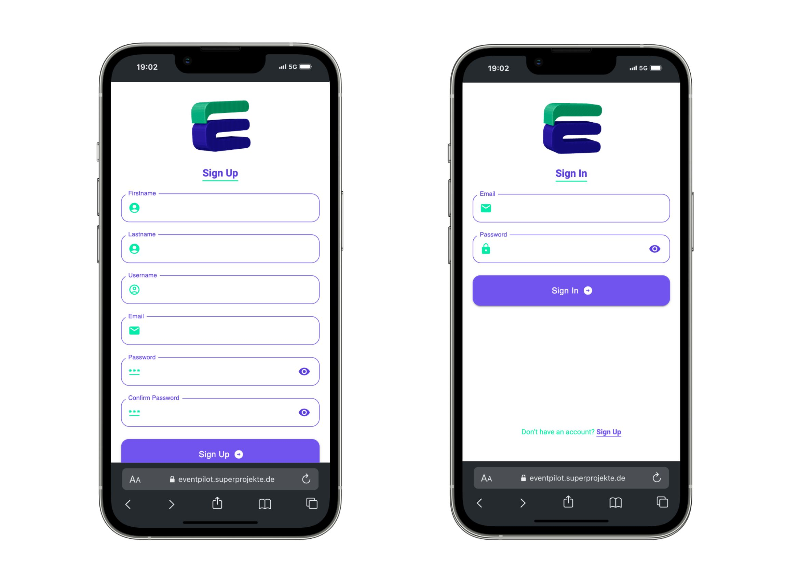
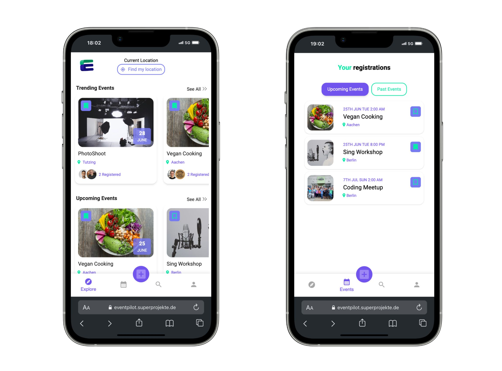
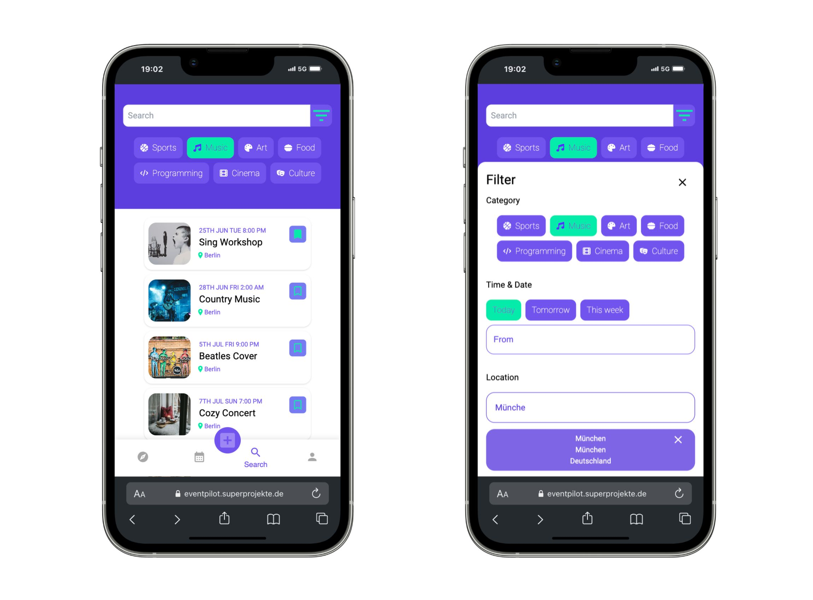
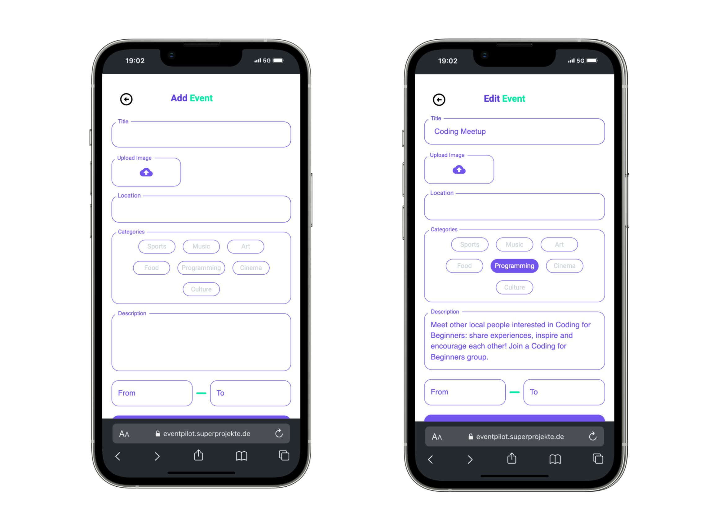
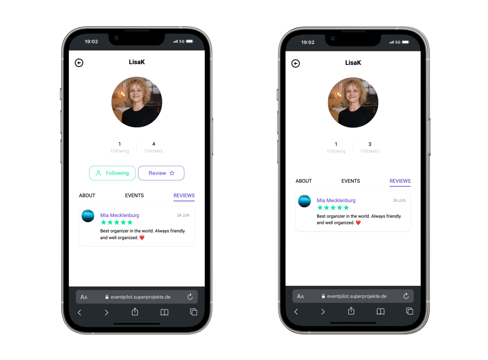
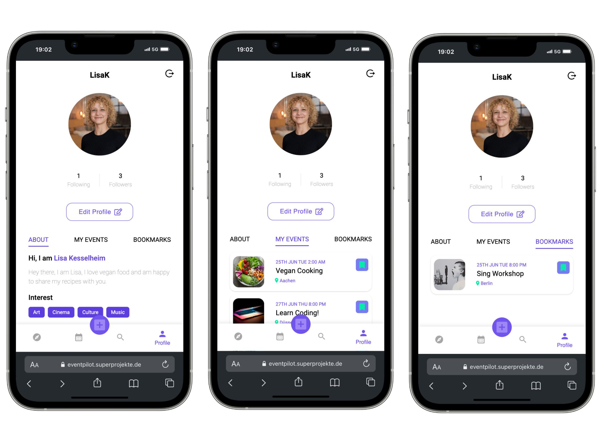
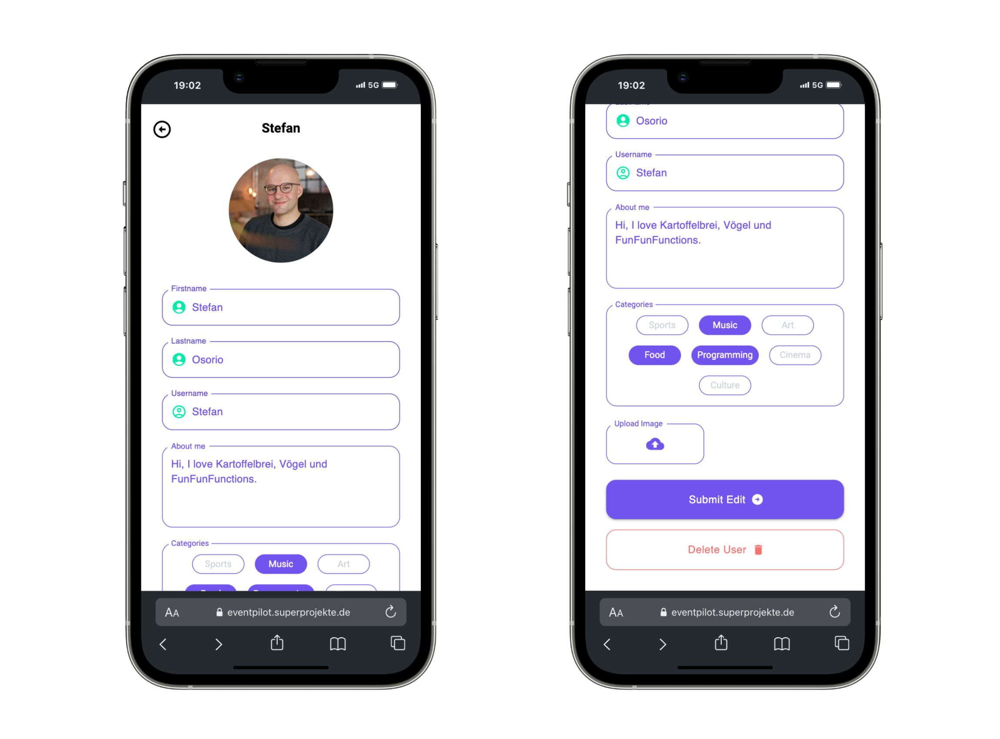

# Collaborative project: EventPilot Mobile App

## Contributors

- [Icaro Boaventura](https://github.com/icaroboaventura)
- [Mia Mecklenburg](https://github.com/MiaMarmeladenbrot)
- [Thomas Erdmenger](https://github.com/thomaserdmenger)

## Purpose of the App

- register as a user and verify your email via six digit code
- login with authorization and authentication
- discover an explore page with trending events, upcoming events and events near you
- create new event incl. image-upload, location-finder and date-picker
- edit events
- delete events with all corresponding bookmarks and registrations
- follow other users
- bookmark events
- register for events
- present your profile, events and reviews to others on your user page
- edit your profile (image-upload, name, bio, interests)
- delete your account

## Links

- [See live site here](https://eventpilot.superprojekte.de/)
- [GitHub Repository](https://github.com/MiaMarmeladenbrot/EventPilot)
- [GitHub Author](https://github.com/MiaMarmeladenbrot)
- [LinkedIn Author](https://www.linkedin.com/in/ann-marie-mia-mecklenburg-99756016a/)

## Screenshots

 

 

 

 

 

 

